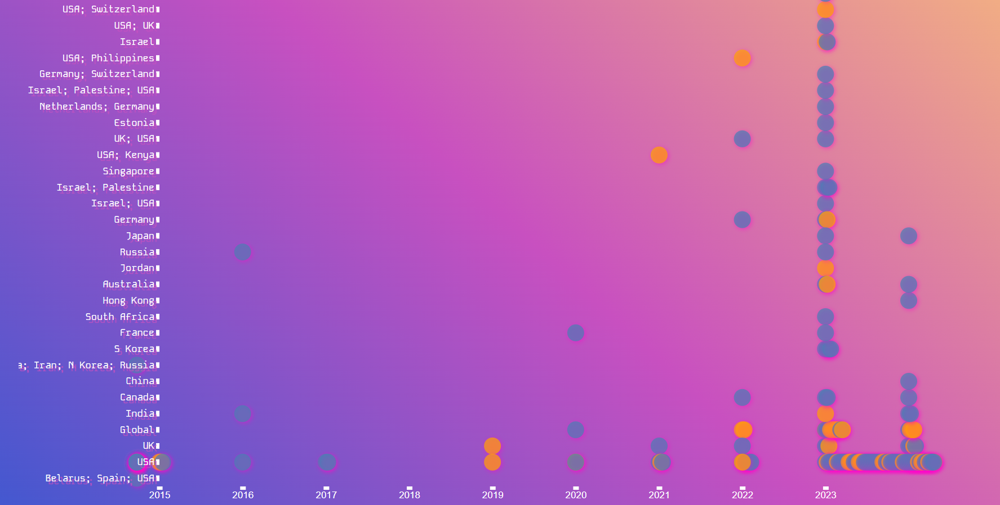

# Creative Data Visualization Using D3

This project is a first attempt at visualizing a series of data using d3.js for the workshop Creative Data Visualizations Using D3 by Shirley Wu.

## Data Visualization Process

The process followed was:

1. **Data:** The data used in this example can be found here ['AI, Algorithmic, and Automation Incidents and Controversies'](https://www.aiaaic.org/aiaaic-repository/about-the-aiaaic-repository). I only used the first 200 entries.

2. **Data Cleaning:** There were no sophisticated steps to clean the data up, I used Countries, Date of Occurrence and Type columns and ignored the rest.

3. **Visualization Design:** As this was my first time working with the library, there were some challenges along the way. The main one being how to keep it visually pleasing and creative while maintaining an approach that actually gives us an insight into the data.

4. **Development & Iteration:** First I created a simple bar chart, then transitioned into different shapes and landed on circles. I used different coloring to indicate whether it was an issue or an incident. The x-axis shows the year of occurrence and the y-axis shows which countries it happened in. There needs to be extra cleanup of the data since some incidents have taken place in multiple countries.

5. **Final Visualizations:** I played around with different color pallettes and decided to use a playful purple/orange gradient with traces of cyan.

Here is the visualization:

6. **Next Steps:** I consider this a very beginner's step into data visualization. I'm fascinated by the power that this field brings and I hope to continue iterating and coming up with better visualizations. It certainly is a challenge to be creative while maintaining a scientific approach. However, this was a fun starting point and I'm hoping to share more of my work later on.

After placing data.csv in the root folder you can run:
`npx parcel index.html`
